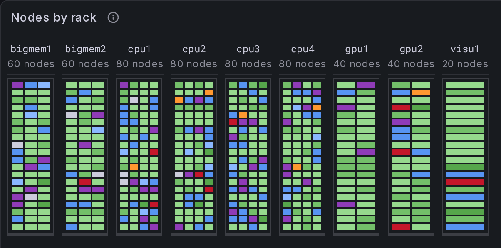
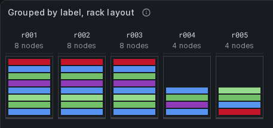

# slurm-views

[](https://github.com/SckyzO/grafana-plugin-slurm-panel/actions/workflows/ci.yml)
[](LICENSE)
[](https://grafana.com/)

Grafana panels for reading a Slurm cluster per node rather than in aggregate.

`slurm_exporter` publishes one series per `(node, partition)` pair:

```
slurm_node_status{node="c1",partition="cpu",status="mixed-"} 1
```

On the test cluster that is **25 series for 20 nodes** — `c1` belongs to `cpu`,
`debug` and `high`, so it appears three times. A `stat` panel counting series
reports 25 nodes. And no stock panel can join `slurm_node_drain_reason_info{node,reason}`,
which carries no `partition` label at all, so the reason a node is drained
cannot be shown beside its state.

The value of this panel is the join and the density, not new data.



## What the panel draws

**One cell per node.** Distinct nodes, not series. A node in three partitions
is one cell, and the panel says so when a node is drawn more than once.

**A floor plan, not a grid.** The rack layout draws each group as a cabinet:
sleds wide and short, filling from the floor. A chassis holding several nodes
is described by **Nodes per blade**, and a cabinet's real height by **Slots per
rack** — so a half-filled rack stands on the floor with its empty slots above
it rather than hanging from the ceiling.



**Colour that says what to do.** Nine colours for twenty-one Slurm states, and
six hues for six decisions: it works, it is free, a human claimed it, it
stopped answering, it is broken, it is gone. What works is drawn light and what
is broken is drawn dark, because protanopia and deuteranopia collapse red
against green and keep light against dark. A shape channel ships **on**, since
six hues cannot separate twenty-one states on colour alone.

**Grouping it does not invent.** Three routes to a topology, separated by the
privilege each needs — Prometheus relabelling at scrape time, a join
transformation carrying an inventory, or a hand-written range table. The panel
is never the source of the topology: it consumes what it is told and names what
it cannot resolve, in a warnings strip above the grid.

**Nothing hidden.** A node that exists is drawn, even when it does not fit what
was declared; a state with no value mapping is drawn hollow and named rather
than coloured by accident. A node missing from a supervision view is a worse
failure than a node drawn in the wrong place.

## Installing

The plugin is **not in the Grafana catalogue yet**, so it installs from a
release archive:

1. Download `tomzone-slurm-panel-<version>.zip` from
   [Releases](https://github.com/SckyzO/grafana-plugin-slurm-panel/releases).
2. Unzip it into Grafana's plugin directory (`/var/lib/grafana/plugins` by
   default). The archive holds exactly one top-level directory, named after the
   plugin id, so this lands as `.../plugins/tomzone-slurm-panel/`.
3. Until it is signed, allow it explicitly — `allow_loading_unsigned_plugins =
   tomzone-slurm-panel` under `[plugins]` in `grafana.ini`, or
   `GF_PLUGINS_ALLOW_LOADING_UNSIGNED_PLUGINS=tomzone-slurm-panel` in the
   environment, which is what this repository's own dev stack does.
4. Restart Grafana.

Requires Grafana **12.3 or later**.

## What is here

| | |
|---|---|
| `plugins/nodegrid-panel` | `tomzone-slurm-panel` — one cell per node |
| `packages/core` | the engine: ingest, state parsing, grouping. No Grafana import |
| `dev/` | the toolchain image, and a self-contained Grafana + Prometheus + synthetic exporter stack |

## Getting started

You need **Docker and make**. Nothing else — no Node, no pnpm, no browser.

```bash
make check   # lint, typecheck, every test, build
make up      # Grafana on http://localhost:3000, panel loaded
make e2e     # browser tests against that stack
```

`make` on its own lists every target. Everything runs inside the image built
from [`dev/Dockerfile.toolchain`](dev/Dockerfile.toolchain), including the
browser, and `node_modules` lives in Docker volumes rather than in the
checkout, so a clone leaves nothing behind on the machine that cloned it.

See [`plugins/nodegrid-panel/src/README.md`](plugins/nodegrid-panel/src/README.md)
for the panel's own documentation — every option, the colour table, and the
three routes to a topology. Then [`dev/README.md`](dev/README.md) for the dev
stack and its two data sources, [`CONTRIBUTING.md`](CONTRIBUTING.md) for how
the toolchain is pinned, and [`docs/value-mappings.md`](docs/value-mappings.md)
before touching a Value mapping by hand — the rules that colour a Slurm state
fail silently when written the obvious way.

The design documents in [`docs/specs/`](docs/specs/) record why each slice is
shaped the way it is, and what it would cost to revisit.

## Licence

Apache-2.0.
